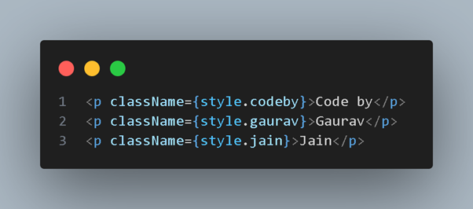

# 🌐 Gaurav Jain — Portfolio

## 🚀 Live Demo
- Website: [GauravJain](https://www.gauravjain.tech)

---
## 📸 Preview
  

---

## 👤 About Me
I’m **Gaurav Jain**, a **full-stack developer** building fast, accessible, and modern web experiences.  

I craft SaaS tools, public websites, and interactive UIs with **Next.js, React, and Node.js** — focusing on **clarity, maintainability, and measurable outcomes**.  

I care deeply about:
- Thoughtful design systems
- Clean architecture
- Strong documentation
- Delightful micro-interactions

---

## ✨ Features
- 📱 Responsive across all devices  
- 🌙 Dark/Light mode toggle  
- 🎞 Smooth animations (GSAP, Framer Motion)  
- 🖼 Interactive projects showcase  
- 📬 Contact form via API route + Nodemailer  
- 🔍 SEO friendly (sitemap, robots, metadata)  

---

## 🛠 Tech Stack
- **Frontend**: Next.js 15, React 18, Tailwind CSS, SASS  
- **Animations**: GSAP, Framer Motion, Locomotive Scroll  
- **Email**: Nodemailer   

---

## 🧩 First Principle

### Problem
Create a portfolio that showcases skills **clearly** while ensuring a **smooth user experience**.

### First Principles
- **Clarity** → Information must be immediately understandable  
- **Performance** → Fast load + smooth transitions  
- **Aesthetics** → Clean design builds trust  
- **Functionality** → Every feature must serve purpose  

### Solution
- Minimalist layout with intuitive navigation  
- Optimized assets & efficient code-splitting  
- Cohesive colors, typography, and spacing  
- Reliable form submission + engaging animations  

---

## 📂 Project Structure

```bash
Portfolio/
├── app/                     # Next.js App Router pages
│   ├── about/               # About section
│   ├── contact/             # Contact section
│   ├── work/                # Projects showcase
│   ├── api/contact/route.js # API for contact form
│   ├── globals.css          # Global styles
│   ├── layout.jsx           # Root layout
│   ├── sitemap.js           # SEO sitemap
│   └── robots.js            # SEO robots
│
├── components/              # Reusable UI components
│   ├── hero/                # Hero section
│   ├── navbar/              # Navbar + animations
│   ├── project/             # Project cards
│   ├── preloader/           # Preloader animation
│   └── themeToggle/         # Dark/Light theme toggle
│
├── common/                  # Shared UI patterns
├── hooks/                   # Custom React hooks
├── public/                  # Images, icons, static files
├── scripts/                 # Utility scripts (e.g., sitemap generator)
├── styles/                  # SCSS modules (modular styles)
├── package.json
├── tailwind.config.js
└── next.config.mjs
````

---

## ⚡ Getting Started

Clone the repo and install dependencies:

```bash
git clone https://github.com/yourusername/portfolio.git
cd portfolio
npm install
```

Run in dev mode:

```bash
npm run dev
```

Environment variables (`.env.local`):

```bash
EMAIL_USER=your-email@example.com
EMAIL_PASS=your-email-password
```

---

## 🎨 Color Palette, Typography, and UI System

Colors are grounded in `app/globals.css` and used via CSS variables.

- **Background Primary**: `#ffffff` (light) / `#0f0f0f` (dark)  
- **Background Secondary**: `#f8f9fa` (light) / `#1a1a1a` (dark)  
- **Text Primary**: `#212529` (light) / `#ffffff` (dark)  
- **Text Secondary**: `#6c757d` (light) / `#cccccc` (dark)  
- **Border**: `#dee2e6` (light) / `#333333` (dark)  
- **Accent Primary**: `#455ce9`  
- **Accent Secondary**: `#2d3a8c`  

### Typography
- **Display/UI**: Plus Jakarta Sans (`--font-display`)  
- **Hero/Headlines**: Outfit (`--font-hero`)  

### UI System
- **Spacing**: Fluid via `clamp()` and Tailwind’s container padding; base grid inspired by **8px system**  
- **Radii**: 12px for hero images; rounded corners for toggles, buttons, and cards  
- **Shadows**: Light/Medium/Heavy tokens, preferring subtle elevation + clear borders  
- **Motion**: 200–500ms ease transitions; GSAP/Framer for staged animations and micro-interactions  

### Fonts:
- **Display/UI**: Plus Jakarta Sans
- **Headings**: Outfit

---

## 📬 Contact

* **Email**: [jaingaurav906@gmail.com](mailto:jaingaurav906@gmail.com)
* **LinkedIn**: [linkedin.com/in/yourusername](https://linkedin.com/in/yourusername)

---
